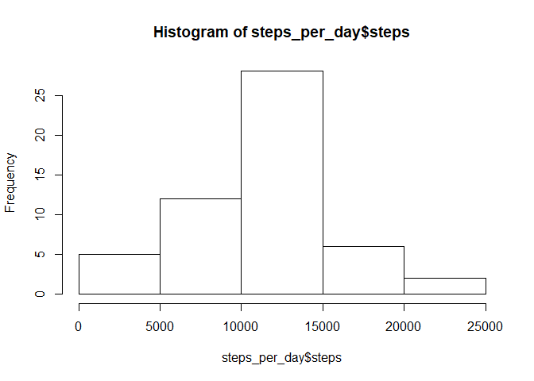

Loading and preprocessing the data
==================================

1.  Load the data (i.e. read.csv())

<!-- -->

    data_activity = read.csv("activity.csv")

1.  Process/transform the data (if necessary) into a format suitable for
    your analysis

<!-- -->

    steps_per_day = 
      aggregate(steps ~ date,data = data_activity, FUN=sum, na.rm=TRUE)

    steps_per_interval_on_average_day = 
      aggregate(steps ~ interval,data = data_activity,FUN=mean, na.rm=TRUE)

What is mean total number of steps taken per day?
=================================================

1.  Make a histogram of the total number of steps taken each day

<!-- -->

    hist(steps_per_day$steps)

1.  Calculate and report the mean and median total number of steps taken
    per day

<!-- -->

    mean(steps_per_day$steps)

    ## [1] 10766.19

    median(steps_per_day$steps)

    ## [1] 10765

What is the average daily activity pattern?
===========================================

1.  Make a time series plot (i.e. type = "l") of the 5-minute
    interval (x-axis) and the average number of steps taken, averaged
    across all days (y-axis)

<!-- -->

    plot(x = steps_per_interval_on_average_day$interval , y = steps_per_interval_on_average_day$steps, type = "l")

1.  Which 5-minute interval, on average across all the days in the
    dataset, contains the maximum number of steps?

<!-- -->

    steps_per_interval_on_average_day$interval[which.max(steps_per_interval_on_average_day$steps)]

    ## [1] 835

Imputing missing values
=======================

1.  Calculate and report the total number of missing values in the
    dataset (i.e. the total number of rows with NAs)

<!-- -->

    sum(is.na(data_activity$steps))

    ## [1] 2304

1.  Devise a strategy for filling in all of the missing values in
    the dataset. The strategy does not need to be sophisticated. For
    example, you could use the mean/median for that day, or the mean for
    that 5-minute interval, etc.

*Strategy: for all missing values of "steps" find the respective
"interval" and replace the missing value with the average steps over all
days for this interval*

1.  Create a new dataset that is equal to the original dataset but with
    the missing data filled in.

<!-- -->

    data_activity_new = data_activity
    for(i in 1:length(data_activity$steps)){
      if (is.na(data_activity$steps[i]))
        data_activity_new$steps[i] = 
         steps_per_interval_on_average_day[steps_per_interval_on_average_day$interval==data_activity$interval[i],2]
    }

1.  Make a histogram of the total number of steps taken each day and
    Calculate and report the mean and median total number of steps taken
    per day. Do these values differ from the estimates from the first
    part of the assignment? What is the impact of imputing missing data
    on the estimates of the total daily number of steps?

<!-- -->

    steps_per_day_new = 
        aggregate(steps ~ date,data = data_activity_new, FUN=sum)

    hist(steps_per_day_new$steps)

    mean(steps_per_day_new$steps)

    ## [1] 10766.19

    median(steps_per_day_new$steps)

    ## [1] 10766.19

    sprintf("Difference in mean: %f - %f = %f",
            mean(steps_per_day$steps),mean(steps_per_day_new$steps),
            mean(steps_per_day$steps)-mean(steps_per_day_new$steps))

    ## [1] "Difference in mean: 10766.188679 - 10766.188679 = 0.000000"

    sprintf("Difference in median: %f - %f = %f",
           median(steps_per_day$steps),median(steps_per_day_new$steps),
           median(steps_per_day$steps)-median(steps_per_day_new$steps))

    ## [1] "Difference in median: 10765.000000 - 10766.188679 = -1.188679"

Are there differences in activity patterns between weekdays and weekends?
=========================================================================

1.  Create a new factor variable in the dataset with two levels --
    "weekday" and "weekend" indicating whether a given date is a weekday
    or weekend day.

<!-- -->

    for (i in 1:length(data_activity_new$date)){
      first_char = substring(weekdays(as.Date(data_activity_new$date[i], format = "%Y-%m-%d")),1,1)
      if (first_char == "S"){
        data_activity_new$weekday[i] = "weekend"
      }else{
        data_activity_new$weekday[i] = "weekday"
      }
    }

1.  Make a panel plot containing a time series plot (i.e. type = "l") of
    the 5-minute interval (x-axis) and the average number of steps
    taken, averaged across all weekday days or weekend days (y-axis).

<!-- -->

    data_on_weeks = 
      data.frame(steps=data_activity_new$steps,interval=data_activity_new$interval,weekday=data_activity_new$weekday)

    steps_per_interval_on_av_weekday = 
      aggregate(steps ~ interval+weekday, data = data_on_weeks,FUN=mean)

    library(lattice)

    xyplot(steps~interval|factor(weekday),data = steps_per_interval_on_av_weekday, type='l',aspect = 1/2)

